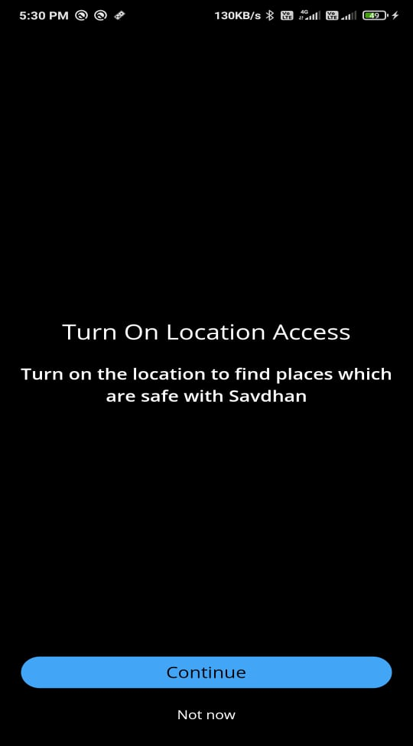

# Savdhaan App

1. The aim of the app is to provide **safety** to all the citizens while they travel/commute.
2. Providing **Area safety** to people purchasing home/lands in an unknown place.
3. Alerting people of **safe and unsafe zones**
4. **Accident prone areas** are also included in the database
---

# Progress so far

## Permission
1. The permission of accessing location data where handled and tested in release and realtime location data is accessed using gps and stored only App state.
2. The location is accessed only when the user is using his phone.
---

## Proguard
1. API keys where hided using android pro guard bu using `flutter_config` package.
---

## Sliding Up Panel 
1. The sliding up panel has been setup and the hidden panel UI has been created
---

## Google Maps
1. GoogleMaps have been rendered on the screen and tested in release mode flutter version was downgraded to `1.22.3` to prevent maps from crashing in release mode.
2. Markers and Circles have beeen tested with dummy data is connected to firebase.
---

## Sliding up panel
A draggable bottom sliding panel displays the nearest police station and hospital details where you can call and navigate to the location. The emergency button allows the user to call the chosen people which, the user would have selected in the initial stage and, a text safe or not safe will indicate whether the user's current location is safe or not safe
---

## What need to be done
1. Connecting maps to firebase and getting the location and there respective crime data == **DONE**
2. Connecting intents to dial to hospital and police station and also to navigate 
3. Getting nearest police station and hospital through places api == **DONE**
---

### Progress Images

Location and Basic Markers Set Up

---

Sliding Panel Set Up and Login Page Shown

---
Sign Up page Set Up and More places fetched from firebase realtime storage

---

#### Team Wasted Potential
Yash Bagri
Sumith G S
Rishabh Bhatt
Shrinivas S V
---
